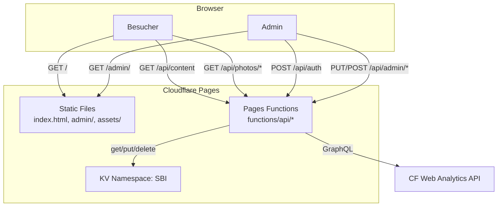
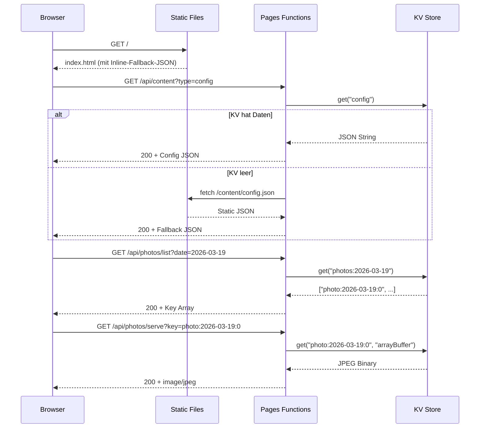
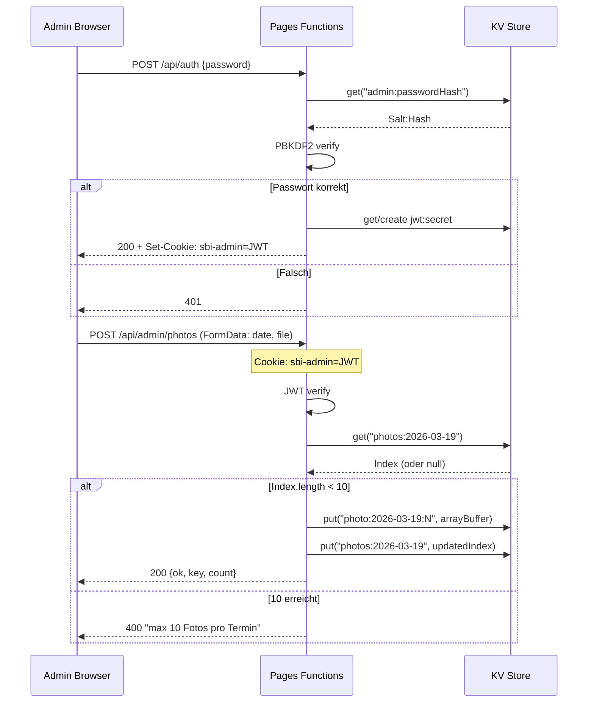

# Snowboard Stammtisch Website — Architektur

Stand: 2026-04-24

## Ueberblick

Serverless Fullstack-App auf Cloudflare Pages. Kein Build-Step, keine Dependencies. Static HTML/CSS/JS + Pages Functions (Workers Runtime) + KV als einzige Datenquelle.



## Kernkomponenten

### Frontend (assets/app.js + styles.css)
- **Was:** Vanilla JS SPA-aehnliches Rendering. Laedt Config + Dates von API, rendert Termine, Fotos, Partner, Countdown
- **Wo:** `assets/app.js` (615 LOC), `assets/styles.css` (381 LOC)
- **Wie:** `load()` → Fetch API → `render()` → DOM-Manipulation. Kein Virtual DOM, kein State Management
- **Abhaengigkeiten:** Keine. Google Fonts (Archivo) per CDN
- **Constraints:** Inline-JSON-Fallback in `index.html` wenn API nicht erreichbar. Foto-Strips lazy-loaded per Klick

### Admin Dashboard (admin/)
- **Was:** Geschuetztes SPA fuer Content-Management: Termine, Config, Partner, Fotos, Analytics
- **Wo:** `admin/index.html` (226 LOC), `admin/admin.js` (592 LOC)
- **Wie:** Cookie-basierte JWT-Session. Tabs fuer Dates/Config/Photos. Client-seitige Bild-Kompression (Canvas → JPEG 0.8, max 1200px)
- **Constraints:** Upload max 2MB pro Foto, max 10 Fotos pro Termin (Server-enforced)

### Auth System (functions/_auth.js)
- **Was:** Passwort-Hashing + JWT-Token-Management, komplett via Web Crypto API
- **Wo:** `functions/_auth.js` (127 LOC)
- **Wie:**
  - Password: PBKDF2 mit 100.000 Iterations, 16-Byte Salt, SHA-256, 32-Byte Key
  - JWT: HMAC-SHA256, 24h Expiry, HttpOnly + Secure + SameSite=Strict Cookie
  - JWT Secret: `env.JWT_SECRET` (Pages Secret) oder auto-generiert in KV (`jwt:secret`)
- **Abhaengigkeiten:** Keine externen. Nur Web Crypto API

### API Layer (functions/api/)
- **Was:** 11 Endpoints (4 public, 7 admin). File-based Routing per CF Pages Convention
- **Wo:** `functions/api/` (11 Dateien)
- **Wie:** Export-Konvention `onRequestGet`, `onRequestPost`, etc. Middleware in `_middleware.js` (CORS)
- **Constraints:** Workers Runtime Limits (CPU, Memory, Subrequests)

### KV Data Model
- **Namespace:** `SBI` (ID: `2b345e290d7d46468c9c8a299cceb92d`)
- **Keys:**

| Key | Typ | Beschreibung |
|-----|-----|-------------|
| `config` | JSON String | Location, Intro, Partner, Links, Time, Season |
| `dates` | JSON String | Seasons-Array mit Terminen |
| `admin:passwordHash` | String | PBKDF2 Hash (Salt:Hash) |
| `jwt:secret` | String | Auto-generierter HMAC-Key |
| `analytics:config` | JSON String | CF Account ID, Site Tag, API Token |
| `photos:{date}` | JSON String | Array von Photo-Keys fuer ein Datum |
| `photo:{date}:{index}` | ArrayBuffer | JPEG-Binary (max 2MB) |

## Sequenz-Diagramme

### Besucher: Seite laden + Fotos ansehen



### Admin: Login + Foto-Upload



## Infrastruktur

```
Cloudflare Pages Project: snowboardstammtisch-website
├── Static Assets (CDN-cached)
│   ├── /*.html (max-age=300)
│   ├── /assets/* (max-age=86400)
│   └── /content/*.json (max-age=60)
├── Pages Functions (Workers Runtime)
│   └── /api/* → functions/api/**/*.js
└── KV Namespace: SBI
    └── Config, Dates, Auth, Photos
```

**Deployment:** `wrangler pages deploy .` (GitHub-Integration derzeit disconnected)

## Architekturregeln

1. **Kein Build-Step.** Alles laeuft direkt — kein Bundler, kein Transpiler
2. **Kein npm.** Zero Dependencies. Nur Web-Standards (Fetch, Crypto, FormData)
3. **KV als einzige Datenquelle.** Kein D1, kein R2, keine externe DB
4. **Inline-Fallback.** Seite funktioniert auch wenn KV/API down ist (Static JSON)
5. **Auth nur via Cookie.** Kein Bearer Token, kein API Key fuer Admin-Endpoints
6. **Fotos in KV.** Max 2MB pro Bild (Client-Kompression), max 10 pro Termin

## Failure Modes

| Symptom | Ursache | Wo pruefen | Fix |
|---------|---------|-----------|-----|
| Seite zeigt Fallback-Daten | KV leer oder API-Fehler | `/api/content?type=config` im Browser | Admin: Login → Seed wird automatisch getriggert |
| Fotos nicht sichtbar | KV-Index leer, Upload fehlgeschlagen | `/api/photos/list?date=YYYY-MM-DD` | Admin: neu hochladen, Fehlermeldung beachten |
| Login geht nicht | Kein Password-Hash in KV | `/api/setup` → needsSetup | `/admin/` oeffnen, Passwort neu setzen |
| Analytics leer | `analytics:config` nicht in KV | Admin Dashboard | Config manuell in KV setzen |
| Deploy aendert nichts | GitHub-Integration disconnected | CF Dashboard | `wrangler pages deploy .` manuell |

## Verzeichnis-Map

```
snowboardstammtisch-website/
├── index.html              Hauptseite
├── impressum.html          Impressum
├── wrangler.toml           CF Pages + KV Config
├── _headers                Caching Rules
├── admin/                  Admin Dashboard
│   ├── index.html
│   └── admin.js
├── assets/                 Frontend Assets
│   ├── app.js              Render-Logik (615 LOC)
│   ├── styles.css          Styling (381 LOC)
│   ├── paper-texture.svg
│   ├── logo-hopfmann.png
│   └── logo-waxelbude.png
├── content/                Static Fallback Data
│   ├── config.json
│   └── dates.json
└── functions/              Cloudflare Pages Functions
    ├── _middleware.js       CORS
    ├── _auth.js             Auth Library
    └── api/
        ├── auth.js          Login
        ├── setup.js         Ersteinrichtung
        ├── content.js       Public Content
        ├── photos/
        │   ├── list.js      Foto-Liste
        │   └── serve.js     Foto-Binary
        └── admin/
            ├── config.js    Config CRUD
            ├── dates.js     Dates CRUD
            ├── seed.js      Static→KV Migration
            ├── password.js  Password Change
            ├── photos.js    Photo Upload/Delete
            └── analytics.js CF Analytics
```
